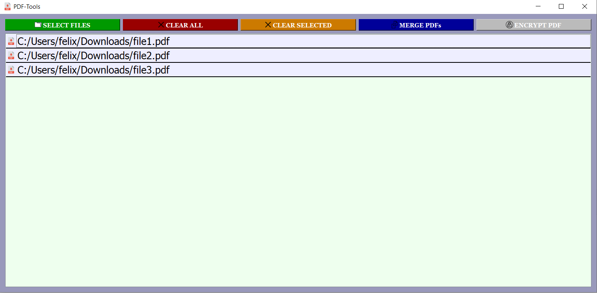

# pdf_tools

Simple PyQt5-GUI for merging and encrypting pdf-files



## Versions

Tested with Python 3.9.5\
For further information check the [environment.yml](../master/environment.yml)

## Environment & Packages

Recreate conda environment
```
conda env create --name your_env_name --file=environment.yml
```
Or simply install the requirements
* PyQt5
* pikepdf
```
pip install -r requirements.txt
```

## Usage

Files can be selected via the GUI or per Drag & Drop from a file explorer

Files displayed in the GUI can be sorted via Drag & Drop

Buttons:
* SELECT FILES: Select one or multiples files from the file explorer
* CLEAR ALL: Remove all files displayed in the GUI
* CLEAR SELECTED: Remove the selected files
* MERGE PDFs: Merge multiple pdf-files together
* ENCRYPT PDF: Encrypt a single pdf-file


```
$ python pdf_tools_gui.py [-m] [-q]

optional arguments:
  -m, --main            Display information about the MainApp-class. Does not start the GUI. Quit with q
  -q, --qlist           Display information about the PDFListWidget-class. Does not start the GUI. Quit with q
```

Sources
-------
#### Icons

The icons used in the GUI are from [ICONS8](https://icons8.com/)


